# Change Value Plugin

 

  

## Conteúdo

- [Sobre](#sobre)
- [Configuração](#configuração)
  - [Capitalization](#capitalization)
    - [Element](#element)
    - [Style](#style)
  - [Values](#values)
    - [Element](#element)
    - [Current Value](#current-value)
    - [Compare Mode](#compare-mode)
    - [All Records](#all-records)
    - [Desired Value](#desired-value)
    - [NULL](#null)
- [Uso](#uso)

## 💭 Sobre

O plugin change_value surge da necessidade de alterar valores já presentes no banco de dados a partir de um elemento de lista do Fabrik. Sendo responsável por verificar o valor atual do elemento e mudá-lo de acordo com as definições do plugin. Sendo também possível alterar o tipo de caixa (caixa alta, caixa baixa e outros) a qual um dado será gravado no banco de dados.

## ⚙️ Configuração

Com o plugin devidamente instalado no Joomla, há duas opções de configuração:

### Capitalization

Responsavel por lidar diretamente com o estilo de letra (no que diz respeito à caixa) que será registrado no banco de dados.

#### Element

Selecionar o elemento ao qual sera aplicado o estilo de letra.

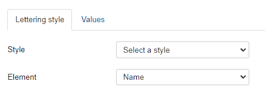

#### Style

Selecionar o tipo de estilo de caixa da letra que será salvo no banco de dados.

- UPPERCASE: Salvara o registro no banco de dados em MAIUSCULO.

  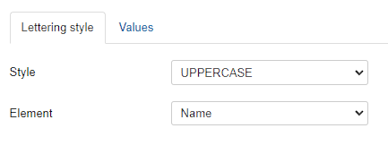

- lowercase: Salvara o registro no banco de dados em minusculo.

  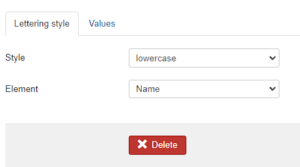

- First character uppercase: Salvara o registro no banco de dados com a Primeira letra maiuscula.

  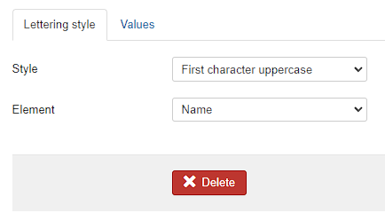

- First Character Of Each Word Uppercase: Salvara o registro no banco de dados com Todas As Primeiras Letras Em Maiusculo.

  

### Values

Responsavel por substituir um valor atual digitado pelo usuário no Element para um outro valor predefinido no plugin.

#### Element

Selecionar o elemento ao qual sera aplicada alteracao de valores.

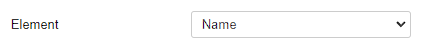

#### Current Value

Inserir o valor atual ao qual sera substituido pelo novo valor

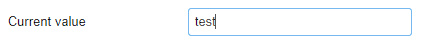

#### Compare Mode

Selecionar a forma a qual sera feita a comparacao entre o valor `Current Value` e o valor registrado pelo `Element` no banco de dados.

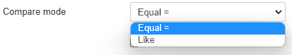

- Equal: Utilizado para valores como `boolean`, `INTEGER`, `FLOAT`, `DECIMAL` e etc.
- Like: Utilizado para valores `VARCHAR`.

#### All Records

Marcar caso queira que todos os registros do banco de dados do `Element` tambem mudem seu valor de `Current Value` para o `Desired Value` de acordo.

#### Desired Value

Inserir o valor que substituira o `Current Value` do `Element`.

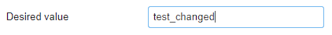

#### NULL

Marcar caso queira trocar o `Current Value` do `Element` por `NULL`.

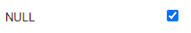

## 💻 Uso

### Captalization

Com o plugin configurado para UPPERCASE, basta inserir o valor no Element escolhido nas configurações do plugin que este será automaticamente transformado em UPPERCASE.

  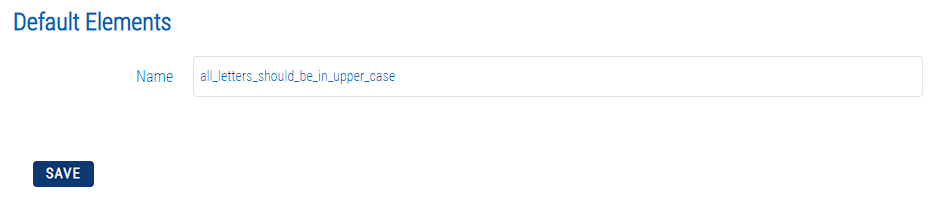 
  Inserindo o valor no element

 

  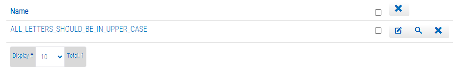 
  Valor na lista

 

  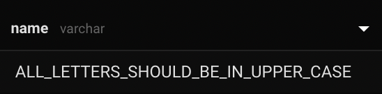 
  Valor no banco de dados

 

### Values

Values configurado para que o `Current Value` igual a `ALL_LETTERS_SHOULD_BE_IN_UPPER_CASE` ser substituído por `brand_new_value` (sendo o `Desired Value`).

_Atenção_: Neste caso também está habilitado o Captalization como uppercase, ou seja, o valor `brand_new_value` será `BRAND_NEW_VALUE`.

  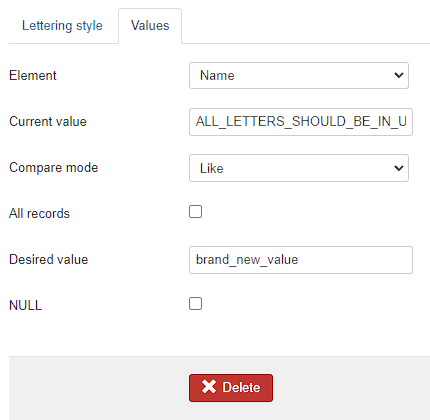 
  Plugin configurado

 

   
  Valor substituído após submissão do formulário "Adicionar"

 
