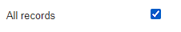

# Change Value Plugin

 

  

- [Sobre](#sobre)
- [Uso](#uso)
  - [Lettering style](#lettering-style)
    - [Element](#element)
    - [Style](#style)
  - [Values](#values)
    - [Element](#element)
    - [Current Value](#current-value)
    - [Compare Mode](#compare-mode)
    - [All Records](#all-records)
    - [Desired Value](#desired-value)
    - [NULL](#null)

## Sobre

O plugin change_value surge da necessidade de alterar valores já presentes no banco de dados a partir de um elemento de lista do Fabrik. Sendo responsável por verificar o valor atual do elemento e mudá-lo de acordo com as definições do plugin.

## Uso

Com o plugin devidamente instalado no Joomla, ha duas opcoes de configuracao:

### Lettering style

Responsavel por alterar a forma como o valor caracter sera armazenado no banco de dados:

#### Element

Selecionar o elemento ao qual sera aplicado o estilo de letra.

#### Style

Selecionar o tipo de estilo de letra que sera salvo no banco de dados.

- UPPERCASE: Salvara o registro no banco de dados em MAIUSCULO.
  
- lowercase: Salvara o registro no banco de dados em minusculo.
  
- First character uppercase: Salvara o registro no banco de dados com a Primeira letra maiuscula.
  
- First Character Of Each Word Uppercase: Salvara o registro no banco de dados com Todas As Primeiras Letras Em Maiusculo.
  

### Values

Responsavel por alterar os valores em si que serao armazenados no banco de dados.

#### Element

Selecionar o elemento ao qual sera aplicada alteracao de valores.

#### Current Value

Inserir o valor atual ao qual sera substituido pelo novo valor

#### Compare Mode

Selecionar a forma a qual sera feita a comparacao entre o valor `Current Value` e o valor registrado pelo `Element` no banco de dados.

- Equal: Utilizado para valores como `boolean`, `INTEGER`, `FLOAT`, `DECIMAL` e etc.
- Like: Utilizado para valores `VARCHAR`.

#### All Records

Marcar caso queira que todos os registros do banco de dados do `Element` tambem mudem seu valor de `Current Value` para o `Desired Value` de acordo.

#### Desired Value

Inserir o valor que substituira o `Current Value` do `Element`.

#### NULL

Marcar caso queira trocar o `Current Value` do `Element` por `NULL`.

